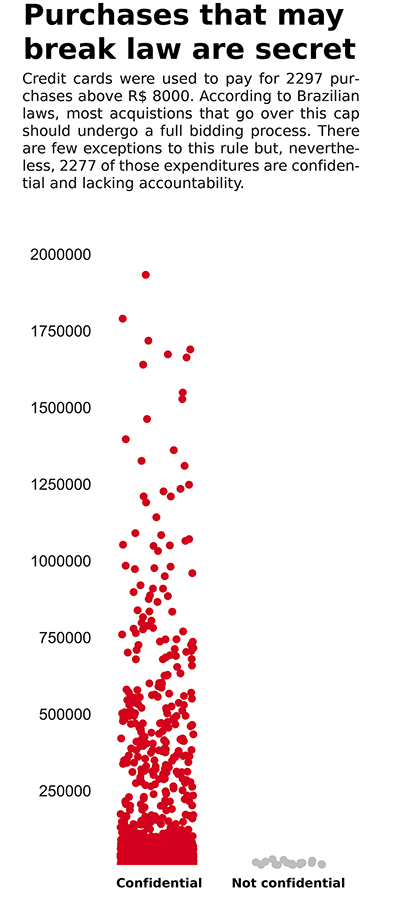

# Since 2010, Brazilian officials ate two steakhouse dinners per day with public money
#### RODRIGO MENEGAT

In the last seven years, Brazilian public funds were used to pay for, on average, two barbecue meals every day.

Since December of 2009, when all the expenses paid with government-sponsored credit cards were made available online, 4911 bills were registered on ‘churrascarias’ – the Brazilian barbecue houses, where, usually, an all-you-can-eat selection of fine cuts is served on sword-like skewers. 

Usually, a meal on a ‘churrascaria’ costs twice or more than in other sort of establishments. On total, around R$ 1,2 million – an amount equivalent to US$ 385,000 – was spent on those restaurants. 

The greatest part of those expenses came from army personnel and staffers from the Ministry of Defense. Indeed, some of the restaurants that received the most money are located near highways, which suggests that officials might be going there to eat during duty travels. Nevertheless, there are many examples of extravagant dinners as well.

In the most recent case, between July 6 and July 10 of 2017, cardholders from the Ministry of Defense’s administrative office went three times to “Fogo de Chão”, a luxurious steakhouse of worldwide fame located in Brasília, the federal capital. In the sum of those, approximately R$ 8600 were spent – an amount sufficient for 62 people to enjoy a pricey R$ 120 (US$ 38) dinner.

In contrast, the average monthly per-capita income of a Brazilian household in 2016, according to the Brazilian Institute of Geography and Statistics (IBGE), was of R$ 1226 – seven times less than the amount spent in prime steaks by the officials in those five days alone.

Talking about the IBGE, it was responsible for some curious purchases as well: between March 2014 and March 2015, a unit of the institution made thirteen payments to an establishment called “Disk-Cerveja” – a beer home-delivery hotline.

The government-sponsored credit cards, officially named Federal Government Payment Card (CPFG, in the Portuguese acronym), were originally created to make it easier for public officials to buy supplies in exceptional cases, when submitting the purchases to a board approval process would take an unreasonable amount of time.

### BREAKING THE LAW
Apart from the questionable nature of expenses with luxury dining and booze delivery, staffers of the public sector that made purchases above R$ 8000 for their agencies possibly broke the Brazilian bidding law. 

According to it, all the acquisitions that surpass this cap should undergo a full bidding process, in which companies would compete to provide the best price. 

There are a few exceptions, such as purchases made during a state of public calamity and the purchase of artistic goods. “Usage material” for the Armed Forces is also among them, in these exact vague terms.

Since 2010, over-the-cap purchases were made 2297 times – and out of those, 2277 cases were deemed confidential to “ensure the safety of the society and the State”. Of the remaining 20 purchases, 17 came, again, from staffers of the Ministry of Defense. The payments were made in automobile parts and computer applicances stores, supermarkets, an internet provider and hotels.

### BLACK BOX
Those questionable expenses can be linked to a broader lack of transparency. Even though all the purchases made with government credit-cards are supposedly available for public scrutiny online, more than 60% those payments are, by all practical means, untraceable.

This happens because around R$ 220 million were deemed confidential by the government for national security issues.

Of that amount, R$ 160 million came from the Federal Police, the Brazilian Intelligence Agency (ABIN), the federal capital security forces, the Army, the Airforce or the tax-collecting agency. The rest comes from the President and Vice-President offices – where expenses are 99% and 97% secret, respectively.
Apart from that, another R$ 60 million was directly withdrew from ATMs – what makes the destination of the money impossible to follow. Overall, then, approximately R$ 280 million spent using government-funded credit cards isn’t transparent.
