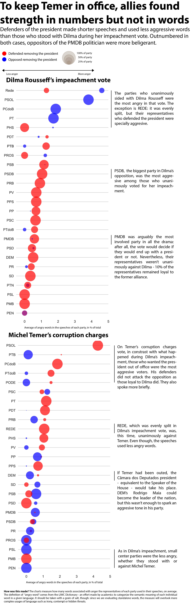
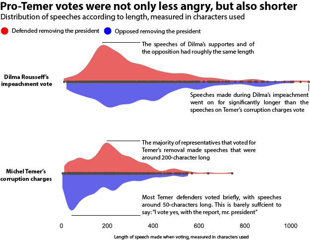

# In the vote about corruption charges, Temer's allies ran away from the spotlight
## Comparatively, allies of Dilma Rousseff spoke for longer and used more aggressive vocabulary when defending her against the impeachment

#### RODRIGO MENEGAT

*“I vote yes”*. Those brief, concise words were spoken hundreds of times at the Câmara dos Deputados – the lower house of Brazilian Congress – in the evening of August 2.

By voting “yes” to a special commission report that said Mr. Michel Temer was innocent, 263 of the 513 representatives decided to stop corruption charges against the current President of the south-american country. If he lost, the Supreme Federal Court could order an official investigation and remove him from office.

Temer’s allies won by a wide margin (for the investigation to continue, the opposition needed to gather 342 votes and only reached 227), but they seem to have ran away from the spotlight.

Their speeches were shorter and less virulent than those made by the opposition. Most of the representatives who sided with the president used around 50 characters in the pronouncements they made when casting the vote. This is barely sufficient to say, in Portuguese, “I vote yes with the report, Mr. President”.

Possibly, they were trying to avoid a strong association with the president that has the lowest popularity ratings in Brazilian politics since the direct elections were reestablished in the country, in 1992.

This behavior is completely different than the one displayed by the representatives that defended Dilma Rousseff during her impeachment vote, in 2016: even being far outnumbered, they spoke for longer and in a more belligerent tone.

A quantitative analysis of the words used in both occasions shows precisely that. Not only Dilma’s defenders spoke considerably more when casting their votes, but they also used a bigger percentage of words related to anger.

What is an angry word, though? The calculations were made using a dictionary that puts words in 64 different categories, made by researchers of the [Interinstitutional Center for Computational Linguistics]( http://www.nilc.icmc.usp.br/nilc/index.php/) from the University of São Paulo (USP). “Anger” is one of those bins.

Results should be taken with a grain of salt, though: since we are evaluating standalone words, the measure will overlook more complex usages of language such as irony, contempt or hidden threats.

