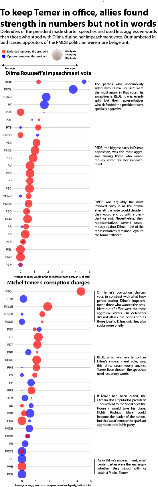

---

layout: project

---

# In the vote about corruption charges, Temer supporters avoided the spotlight
## Comparatively, allies of Dilma Rousseff spoke for longer and used more aggressive vocabulary when defending her against the impeachment

#### RODRIGO MENEGAT

*“I vote yes”*. Those brief, concise words were spoken hundreds of times at the Câmara dos Deputados – the lower house of Brazilian Congress – in the evening of August 2. By voting “yes” to a special commission report that said Mr. Michel Temer was innocent, 263 of the 513 representatives decided to stop the corruption charges against the current President. If he had lost, the Supreme Federal Court could order an official investigation and remove him from office.

Temer’s allies won by a wide margin. For the investigation to continue, the opposition needed to gather 342 votes, but only reached 227. Despite being the undisputable majority, though, they seem to have ran away from the spotlight. The speeches they delivered when voting were shorter and less virulent than those of the the opposition. This behavior is completely different than the one displayed by the representatives that defended Dilma Rousseff during her impeachment vote, in 2016: even being far outnumbered, her supporters spoke for longer and in a more belligerent tone.

A quantitative analysis of the words used by congressmen in both occasions shows precisely that. Most of the representatives who sided with Temer used around 50 characters in their pronouncements. This is barely sufficient to say, in Portuguese, “I vote yes with the report, Mr. President”. Not only Dilma’s defenders spoke considerably more, but they also used a bigger percentage of words that express anger. 

Possibly, Temer supporters were trying to avoid a strong association with the president that has the lowest popularity ratings in Brazilian politics since the direct elections were reestablished in the country, in 1992. Dilma's ratings were also low in 2016, but some sectors of Brazilian society gave her vocal support until the very end. The perspective of seeing their president deposed in what they considered a "soft coup" may have sparked rage among those who sided with her.

But, after all, what is considered an angry word? Those calculations were made using a dictionary that puts words in 64 different categories, translated from english by researchers of the [Interinstitutional Center for Computational Linguistics]( http://www.nilc.icmc.usp.br/nilc/index.php/) from the University of São Paulo (USP). “Anger” is one of those bins.

Results should be taken with a grain of salt: since we are evaluating standalone words, the measure will overlook more complex usages of language such as irony, contempt or hidden threats.

