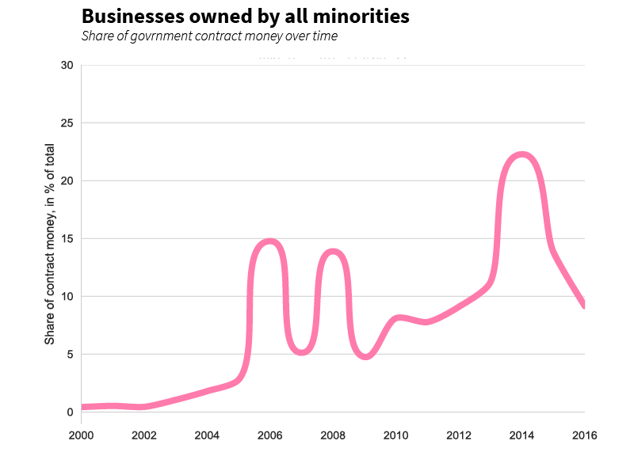
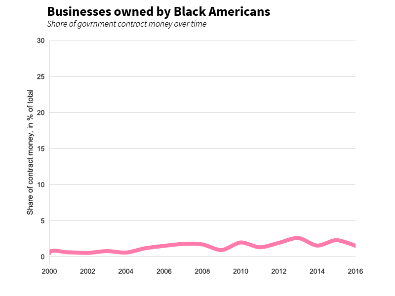
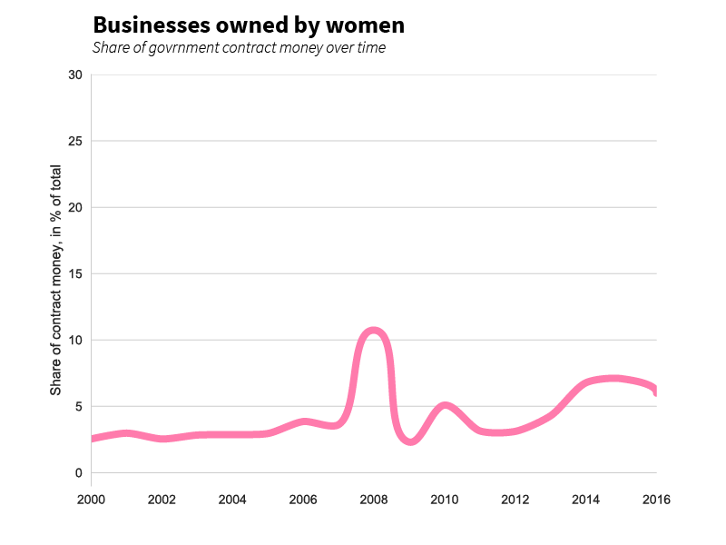
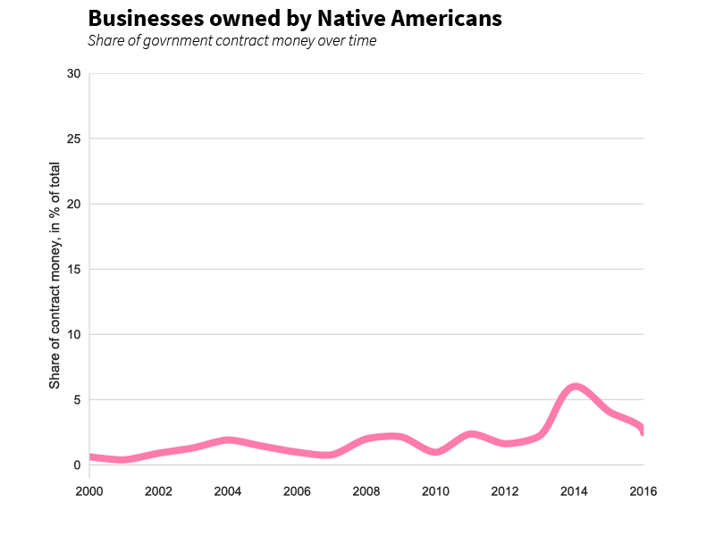
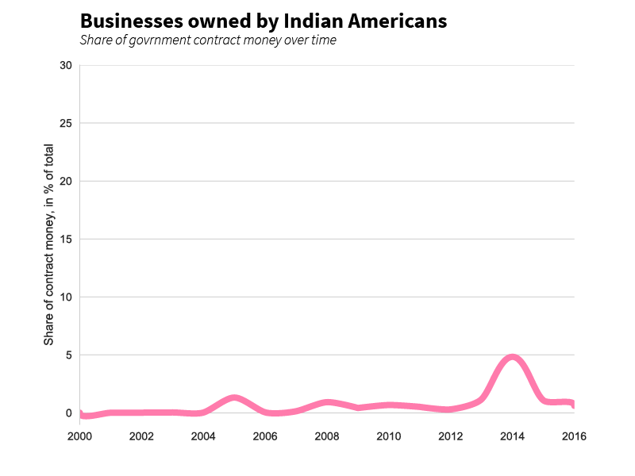
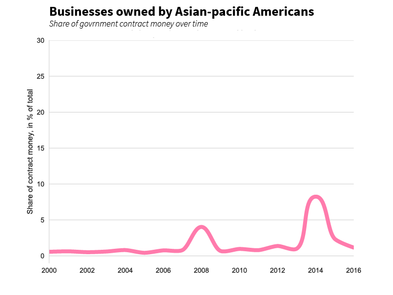

# Are minorities-owned business geting a bigger share of governmental contract money?
## Not really, shows a random sample of the data.
#### RODRIGO MENEGAT, DEMETRIOS POGKAS, NANDINI MALIK, MRINALINI TAVAG

In the last two-years, the share of government-contract payments that went to minorities-owned bussiness saw a sharp decline, as a random sample of the dataset provided by Enigma shows.

In 2014, around 22% of the money from the analyzed contracts went to those businesses, marking the peak of an upward trend that started in the early 2000s. Two years later, there was a decline that made the value go back to approximately what it was in 2012.

A breakdown by categoriy provides deeper insight. Black americans are still the minority with less access to those contracts.
Even though the overall trend is downwards, companies that are ran by women still saw a steady incrase from 2012 to 2014, with only minor losses in the last year.

